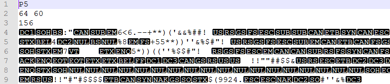

# 图像处理与模式识别大作业3

*何嘉怡，19373611*

## 理论推导

在阅读完作业要求后，我仍然对K-L变换在人脸中起到的作用不甚明朗，所以去wiki上搜索了该项的定义：K-L转换(Karhunen-Loève Transform)是建立在统计特性基础上的一种转换，它是均方差(MSE, Mean Square Error)意义下的最佳转换，因此在资料压缩技术中占有重要的地位。

## 开发环境

## 代码解析

## 操作步骤

## 结果展示

## 开发环境

## 代码解析

## 操作步骤

## 结果展示

1. 第一行内容“P5”表示.pgm文件的模式。
2. 第二行“64, 60”表示图片的宽度、图片的高度。
3. 第三行“156”表示图片数据的最大值。
4. 第三行之后的文件表示图片的像素值。每个像素用可以用二进制表示。比如灰度值可能的最大值为255，它的第一行第一列像素值为100，那么该图像每个像素使用一个字节表示，第一行第一列为数值为100的二进制一个字节表示。如果灰度值可能的最大值是65535，那么它的第一行第一列为数值为100的二进制，使用两个字节表示(因为表示到65535需要两个字节)。
