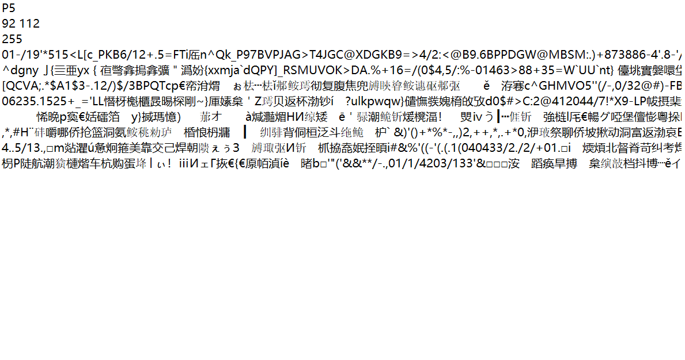
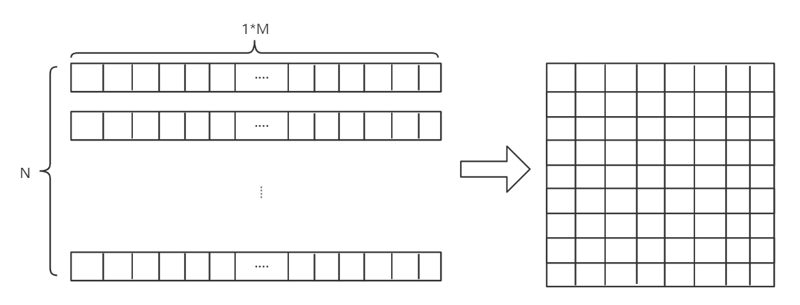
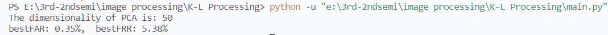
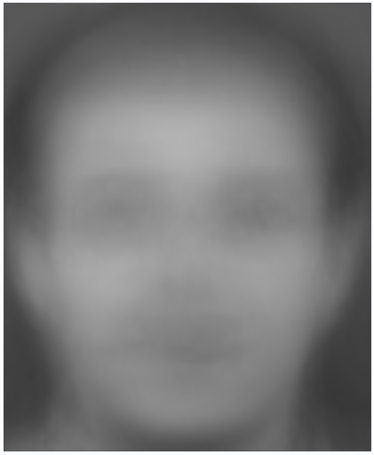

# 图像处理与模式识别大作业3: K-L人脸识别

*何嘉怡，19373611*

[TOC]

## 理论推导

### pgm文件

pgm文件的主要结构是：



1. 第一行内容“P5”表示.pgm文件的模式。
2. 第二行“92, 112”表示图片的宽度、图片的高度。
3. 第三行“255”表示图片数据的最大值。
4. 第三行之后的文件表示图片的像素值，每个像素用二进制表示。灰度值的最大值为255，那么该图像每个像素使用一个字节表示。

### K-L变换与PCA

在阅读完作业要求后，我仍然对K-L变换在人脸中起到的作用不甚明朗，所以去wiki上搜索了该项的定义：K-L转换(Karhunen-Loève Transform)是建立在统计特性基础上的一种转换，它是均方差(MSE, Mean Square Error)意义下的最佳转换，因此在资料压缩技术中占有重要的地位。而联想到常见的提取特征的方法主成分分析PCA，我进一步了解了两者的区别：PCA的变换矩阵是协方差矩阵，K-L变换的变换矩阵可以有很多种（二阶矩阵、协方差矩阵、总类内离散度矩阵等等）。当K-L变换矩阵为协方差矩阵时，等同于PCA。

因此，求样本$x_i$的$k$维的主成分其实就是求样本集的协方差矩阵$\frac{1}{m}XX^T$的前$k$个特征值对应特征向量矩阵$P$，然后对于每个样本$x_i$ ,做如下变换$y_i=Px_i$​，即达到降维的PCA目的。下面简单叙述PCA的算法流程。

输入：$n$维样本集$X=(x_1,x_2,\cdots,x_m)$，要降维到的维数$k$

输出：降维后的样本集

1. 对所有的样本进行规范化
2. 计算样本的协方差矩阵
3. 求出协方差矩阵对应的特征值和特征向量
4. 将特征向量按照对应特征值的大小排序，取前k行为矩阵，即为降维后的数据

PCA算法仅仅需要以方差衡量信息量，不受数据集以外的因素影响；同时各主成分之间正交，可消除原始数据成分间的相互影响的因素；同时PCA的计算方法简单，易于实现。通过PCA提取人脸的特征后，能够聚焦于主要特征之间的联系，而忽略一些细节，再通过进一步分类实现人脸识别。

## 代码解析

### `convert_pgm_P5`

这个文件用于将原始的.pgm文件转化为存储矩阵，具体操作是：

1. 提取第一行，判断是否是P5格式的文件；

2. 提取第二行，判断图像的长宽；

3. 提取第三行，判断每个像素的最大字节数`maxval`

   注意此处需要对`maxval`进行判断，如果大于256表示每个像素需要两个字节存储，反之只需要一个字节。

4. 提取第三行之后的数据，将其转化为utf-8数据表示并存储在一个矩阵中，即为图像对应像素的原始矩阵。

```python
def convert_pgm_P5(f):
    magic_number = f.readline().strip().decode('utf-8')  # P5
    if not operator.eq(magic_number, "P5"):
        raise Exception("Error with magic number.")
    width, height = f.readline().strip().decode('utf-8').split(' ')  # 长宽
    width = int(width)
    height = int(height)
    maxval = f.readline().strip()  # 最大字节数
    if int(maxval) < 256:
        pad = 1
    else:
        pad = 2
    img = np.zeros((height, width))
    img[:, :] = [[ord(f.read(pad)) for j in range(width)]
                 for i in range(height)]
    return img
```

### `process_data`

此函数表示对数据进行预处理。对于训练集中的每张图片，首先调用`convert_pgm_P5`函数将pgm文件中的像素矩阵提取出来，再将该矩阵压缩到一行。最后，将每张图片压缩而成的矩阵拼接，假设一共有$N$张图片，每张图片压缩而成的矩阵大小是$1*M$，则最后得到的矩阵大小为$N*M$。

```python
def process_data(rootDir):
    mat = None
    cnt = 0
    for _, dirs, _ in os.walk(rootDir):
        for dir in dirs:
            for _, _, files in os.walk(os.path.join(rootDir, dir)):
                for file in files:
                    if os.path.splitext(file)[1] == '.pgm':
                        f = open(os.path.join(rootDir, dir, file), 'rb')
                        img = convert_pgm_P5(f)
                        img = img.reshape(1, -1)
                        if cnt == 0:
                            mat = img
                        else:
                            mat = np.concatenate((mat, img), axis=0)
                        cnt += 1
    return [mat, cnt]
```

示意图为：



### `PCA`

这个函数对应PCA（也就是离散区间上的K-L变换）的计算过程。为了便于后续验证，将计算得到的矩阵均以.npy的文件格式存储。

1. 第2行：首先计算出每列的平均值，即对应所有图片的平均值。
2. 第4行：用原矩阵减去平均值，得到该图片的独有特征。
3. 第6行：计算原矩阵的协方差矩阵。
4. 第7行：计算协方差矩阵对应的特征值和特征向量
5. 第10-11行：将特征向量按照特征值的大小进行排序，选取前k维作为提取出的主特征。这里k我选择取50，具体原因下方叙述。这里k维特征组成的向量空间，也是人脸识别最后会用到的特征空间。
6. 第12行：将规范化的矩阵的转置乘以上述特征空间，即得到图像在这个特征空间上的位置（以向量的形式表示）
7. 第14行：计算从原矩阵到特征空间的映射，后面实际上没有用到。

```python
def PCA(mat, k):
    mean = np.mean(mat, axis=0)
    np.save('./matrix/mean.npy', mean)
    stdMat = mat - mean
    np.save('./matrix/stdMat.npy', stdMat)
    covMat = np.cov(stdMat)
    feaVal, feaVec = np.linalg.eig(covMat)
    np.save('./matrix/feaVal.npy', feaVal)
    np.save('./matrix/feaVec.npy', feaVec)
    index = np.argsort(feaVal)
    sortedFeaVec = feaVec[:, index[:-k-1:-1]]
    eigenface = np.dot(stdMat.T, sortedFeaVec)
    np.save('./matrix/eigenface.npy', eigenface)
    trainSample = np.dot(stdMat, eigenface)
    np.save('./matrix/trainSample.npy', trainSample)
```

上述过程为利用训练集进行训练（实际是得到特征空间）。

------

下述过程是对测试集进行测试。

### `load_pic`

仿照训练集中对数据的处理，对测试集中的图片进行类似处理，将图片映射到特征空间并返回对应矩阵。

```python
def load_pic(f):
    img = convert_pgm_P5(f)
    img = img.reshape(1, -1)
    meanMat = load_matrix('mean')
    normMat = img - meanMat
    eigenface = load_matrix('eigenface')
    testSample = np.dot(normMat, eigenface)
    return testSample
```

### `batch_test`

由于需要计算FAR和FRR两个指标，所以需要对整个测试集中的数据进行统一测试。

1. 第4-18行：处理测试集的数据，并将其存储到一个矩阵`testMat`中。
2. 第22-28行：测试集中每两张图片分别计算欧式距离，并将结果存储到一个列表`mark`中。
3. 第29-30行：对`mark`中的数据进行排序，并返回对应下标。将列表中的第二个值作为阈值`thres`，这一阈值十分重要，因为**判定标准即是：两张图片之间的欧式距离小于阈值即视为同一个对象；反之视为不同对象。**
4. 第31-42行：逐一计算FAR和FRR。

```python
def batch_test(rootDir):
    testMat = None
    cnt = 0
    for _, dirs, _ in os.walk(rootDir):
        for dir in dirs:
            for _, _, files in os.walk(os.path.join(rootDir, dir)):
                for file in files:
                    if os.path.splitext(file)[1] == '.pgm':
                        num = os.path.splitext(file)[0]
                        # print("Start testing pic{} of {}".format(num, dir))
                        f = open(os.path.join(rootDir, dir, file), 'rb')
                        testSample = load_pic(f)
                        if cnt == 0:
                            testMat = testSample
                        else:
                            testMat = np.concatenate(
                                (testMat, testSample), axis=0)
                        cnt += 1
    scale = testMat.shape[0]
    farCnt = 0
    frrCnt = 0
    for i in range(scale):
        mark = []
        for j in range(scale):
            if i == j:
                continue
            dis = np.linalg.norm(testMat[i] - testMat[j])
            mark.append(dis)
        key = sorted(enumerate(mark), key=lambda x: x[1])
        thres = key[1][1]
        for k in range(scale-1):
            if key[k][1] < thres and key[k][0]//10 != i//10:
                farCnt += 1
            if key[k][1] > thres and key[k][0]//10 == i//10:
                frrCnt += 1
    totalNum1 = scale * 9
    totalNum2 = scale * (scale - 1) - totalNum1
    far = farCnt/totalNum1
    frr = frrCnt/totalNum2
    print(str(totalNum1) + '    '+ str(totalNum2))
    # print("FAR: {:.2%},  FRR: {:.2%}".format(far,frr))
    return far,frr
```

**此处简单解释为什么选取这一值作为阈值：对于每两张图片之间，欧式距离最小表示两张图片特征越接近，越有可能指向同一个对象。如果选取阈值过大，更可能将不是同一个人的两张照片视为同一个人，为了控制FAR在1%以内，经过简单实验最终决定取第二小的值作为阈值。**

### `main`

主函数。

```python

if __name__ == '__main__':
    trainDir = './data/train'
    testDir = './data/test'
    k = 50

    trainMat, num = process_data(trainDir)
    PCA(trainMat, k)
    minfar,minfrr = batch_test(testDir)
    # best = 0
    # for i in range(10,200):
    #     PCA(trainMat, i)
    #     far,frr = batch_test(testDir)
    #     if far<minfar:
    #         minfar = far
    #         minfrr = frr
    #         best = i
    #     print("Iter{}: bestFAR->{:.2%},  bestFRR->{:.2%}".format(i,minfar,minfrr))
    # print(best)
    print("The dimensionality of PCA is: %d"%k)
    print("bestFAR: {:.2%},  bestFRR: {:.2%}".format(minfar,minfrr))
```

其中注释掉的部分即为k的选取实验过程。k依次从10取到200，分别判断取k维主成分后判断的结果，发现k取50的时候就已经收敛到最优。

## 运行步骤

### 结果展示

直接运行`main.py`即可，得到的结果为：



可以发现FAR值为0.35%，FRR值为5.38%，满足要求。

### 平均脸展示

调用`display_mean`函数，可以得到一张平均脸，如图所示：


